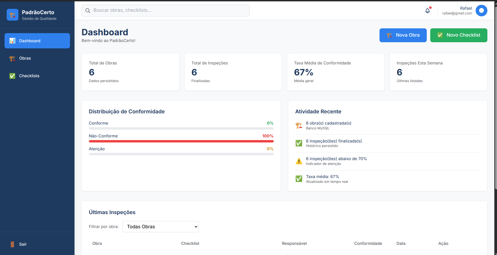
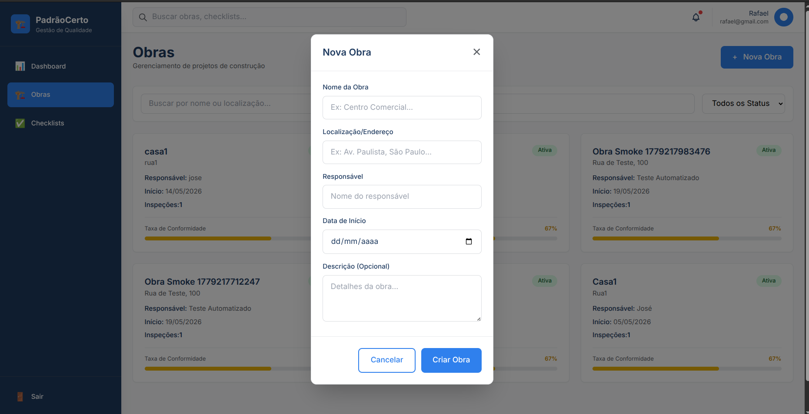
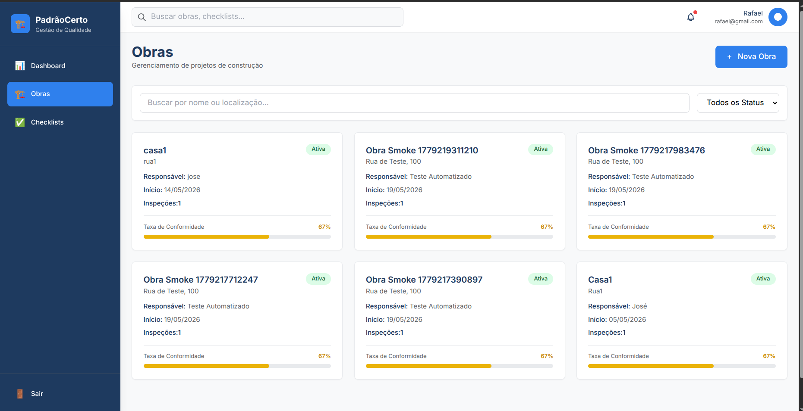
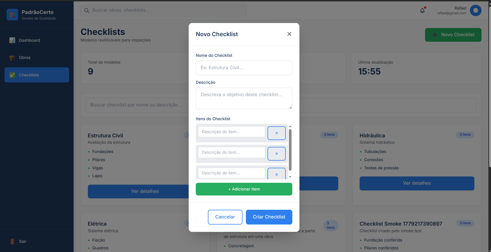
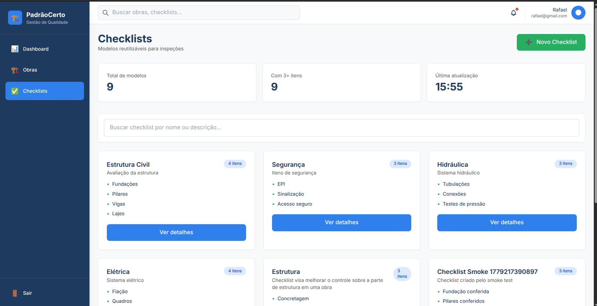

# PadrãoCerto

**Sistema web para gerenciamento de inspeções e controle de qualidade em obras da construção civil**

---

## 📌 Objetivo do Projeto

O PadrãoCerto foi desenvolvido para auxiliar engenheiros, técnicos e responsáveis por obras no processo de inspeção de qualidade, padronização de checklists e geração de relatórios de conformidade.

O sistema busca melhorar:
- Rastreabilidade das inspeções
- Controle de não conformidades
- Padronização dos processos
- Geração de evidências
- Acompanhamento das obras em tempo real

---

## 🎯 Frameworks Utilizados

### **Frontend: Vue.js 3**

#### O que é Vue.js?
Vue.js é um framework JavaScript progressivo utilizado para construir interfaces de usuário interativas. É conhecido por sua facilidade de aprendizado, documentação clara e abordagem flexível.

#### Características principais:
- **Reatividade**: Sincronização automática entre dados e interface
- **Componentes**: Reutilizáveis e isolados
- **Virtual DOM**: Otimização de performance
- **Ferramentas de desenvolvimento**: Vue DevTools para debug

#### Por que escolhemos Vue.js?
- Curva de aprendizado menor comparado ao React
- Melhor documentação que Angular
- Performance adequada para aplicações CRUD
- Ecossistema robusto com Vue Router e Pinia

#### Ferramentas complementares:
- **Vue Router**: Roteamento de páginas (lista, edição, detalhes)
- **Pinia**: Gerenciamento de estado global (autenticação, dados do usuário)
- **Axios**: HTTP client para comunicação com backend
- **Vite**: Build tool moderno e rápido

### **Backend: Express.js**

#### O que é Express.js?
Express.js é um framework Node.js minimalista e flexível para construir APIs REST e aplicações web. É o framework mais popular do Node.js.

#### Características principais:
- **Roteamento simples**: Fácil definição de endpoints
- **Middleware**: Processamento de requisições em camadas
- **Lightweight**: Apenas o necessário, sem overhead
- **Comunidade grande**: Muitos pacotes e soluções disponíveis

#### Por que escolhemos Express.js?
- Integração perfeita com Node.js
- Performance superior para APIs REST
- Flexibilidade para implementar padrões arquiteturais (MVC)
- Suporte nativo a middleware para autenticação (JWT)
- Documentação abundante

#### Ferramentas complementares:
- **Node.js**: Runtime JavaScript server-side
- **JWT (JSON Web Tokens)**: Autenticação stateless
- **Sequelize**: ORM para abstração de banco de dados
- **MySQL**: Persistência de dados

---

## 🛠️ Tecnologias Utilizadas

### Frontend
- Vue.js 3
- Vue Router (navegação)
- Pinia (gerenciamento de estado)
- Axios (requisições HTTP)
- Vite (build tool)

### Backend
- Node.js (runtime)
- Express.js (framework)
- JWT (autenticação)
- Sequelize (ORM)

### Banco de Dados
- MySQL 8

### Infraestrutura
- Docker
- Docker Compose
- phpMyAdmin (interface MySQL)

---

## 📐 Arquitetura do Projeto

O projeto foi estruturado seguindo o padrão **MVC (Model-View-Controller)**:

### **Frontend (View)**
- Componentes Vue.js reutilizáveis
- Páginas para operações CRUD (Create, Read, Update, Delete)
- Comunicação com backend via API REST

### **Backend (Controller + Model)**
- Rotas Express.js que recebem requisições
- Controladores que processam lógica de negócio
- Modelos Sequelize que representam tabelas do banco

### **Banco de Dados (Data)**
- MySQL com tabelas normalizadas
- Relacionamentos entre entidades

### Fluxo de Requisição:
```
1. Usuário interage com componente Vue (Frontend)
2. Axios realiza requisição HTTP
3. Express.js roteia para controlador apropriado
4. Controlador acessa modelo via Sequelize
5. Dados retornam em JSON
6. Vue atualiza interface reativa
```

---

## 📂 Estrutura do Projeto

```bash
padraocerto/
│
├── backend/
│   ├── src/
│   │   ├── controllers/      # Lógica de negócio
│   │   ├── models/           # Definição de tabelas
│   │   ├── routes/           # Endpoints da API
│   │   ├── middleware/       # Autenticação, validação
│   │   └── app.js            # Configuração Express
│   ├── Dockerfile
│   └── package.json
│
├── frontend/
│   ├── src/
│   │   ├── components/       # Componentes Vue reutilizáveis
│   │   ├── views/            # Páginas (lista, edição, detalhes)
│   │   ├── router/           # Rotas Vue Router
│   │   ├── stores/           # Estado global (Pinia)
│   │   └── App.vue           # Componente raiz
│   ├── Dockerfile
│   └── package.json
│
├── docs/
│   └── ui/                   # Prints e mockups
│
├── docker-compose.yml        # Orquestração de containers
├── .gitignore
└── README.md
```

---

## 🚀 Como Executar o Projeto

### Pré-requisitos
- Docker e Docker Compose instalados
- Porta 5173 (frontend) disponível
- Porta 3000 (backend) disponível
- Porta 3306 (MySQL) disponível
- Porta 8080 (phpMyAdmin) disponível

### Passos para execução

```bash
# 1. Clone o repositório
git clone https://github.com/RafaelTeixeira1/padraocerto.git
cd padraocerto

# 2. Inicie os containers
docker compose up --build -d

# 3. Aguarde ~10 segundos para inicialização
sleep 10

# 4. Acesse a aplicação
# Frontend: http://localhost:5173
# Backend: http://localhost:3000
```

### Para parar os containers

```bash
docker compose down
```

---

## 🌐 Acessos e Portas

| Serviço | Porta | URL |
|---|---|---|
| Frontend (Vue.js) | 5173 | http://localhost:5173 |
| Backend (Express.js) | 3000 | http://localhost:3000 |
| Health Check | 3000 | http://localhost:3000/health |
| phpMyAdmin | 8080 | http://localhost:8080 |
| MySQL | 3306 | localhost:3306 |

### Credenciais MySQL (padrão)
- Usuário: `root`
- Senha: `root`
- Banco: `padraocerto`

---

## 📋 Funcionalidades Implementadas

### ✅ CRUD Completo

#### 1. **Cadastro** (CREATE)
- Formulário para criar novas entidades
- Validação de dados no frontend e backend
- Mensagens de sucesso/erro

#### 2. **Listagem** (READ)
- Visualização de todos os registros
- Tabela com paginação e filtros
- Acesso aos dados via API REST

#### 3. **Edição** (UPDATE)
- Formulário pré-preenchido com dados existentes
- Atualização em tempo real
- Validação antes de enviar

#### 4. **Exclusão** (DELETE)
- Confirmação antes de remover
- Deleção em cascata conforme necessário
- Feedback visual ao usuário

---

## 🖼️ Funcionalidades em Ação

### 1. Dashboard Principal



Visão geral do sistema com estatísticas e acessos rápidos às principais funcionalidades.

---

### 2. Criação de Obras



Interface para cadastrar novas obras no sistema com todas as informações necessárias.



Visualização detalhada da obra criada com todas as informações e ações relacionadas.

---

### 3. Criação de Checklists



Formulário para criar novos checklists padronizados que serão utilizados nas inspeções.



Formulário para criar novos checklists padronizados que serão utilizados nas inspeções.

---

## 🔑 Principais Recursos do Framework

### Express.js
- **Middleware**: Processamento de requisições (autenticação, validação)
- **Roteamento dinâmico**: Organização de endpoints por recurso
- **Tratamento de erros**: Middleware centralizador de exceções
- **Integração com banco**: ORM Sequelize para queries seguras

#### Exemplo: Configuração e CRUD básico

`backend/src/server.js` ou `backend/src/routes/inspections.js`

```javascript
const express = require("express");
const app = express();

app.use(express.json());

// CREATE
app.post("/api/inspections", (req, res) => {
  const inspection = await Inspection.create(req.body);
  res.status(201).json(inspection);
});

// READ
app.get("/api/inspections", async (req, res) => {
  const inspections = await Inspection.findAll();
  res.json(inspections);
});

// UPDATE
app.put("/api/inspections/:id", async (req, res) => {
  await Inspection.update(req.body, { where: { id: req.params.id } });
  res.json({ message: "Atualizado" });
});

// DELETE
app.delete("/api/inspections/:id", async (req, res) => {
  await Inspection.destroy({ where: { id: req.params.id } });
  res.json({ message: "Deletado" });
});

app.listen(3000);
```

### Vue.js 3
- **Composition API**: Código mais organizado e reutilizável
- **Reatividade automática**: Sincronização dados ↔ interface
- **Componentes scoped**: Estilos isolados por componente
- **Diretivas úteis**: `v-if`, `v-for`, `v-on` para controle de DOM

#### Exemplo: Componente Vue.js com CRUD

`frontend/src/views/Inspections.vue` ou `frontend/src/components/InspectionList.vue`

```vue
<template>
  <div>
    <h1>Inspeções</h1>
    
    <form @submit.prevent="create">
      <input v-model="form.title" placeholder="Título" />
      <button>Criar</button>
    </form>
    
    <table>
      <tr v-for="item in inspections" :key="item.id">
        <td>{{ item.title }}</td>
        <td>
          <button @click="update(item)">Editar</button>
          <button @click="delete(item.id)">Deletar</button>
        </td>
      </tr>
    </table>
  </div>
</template>

<script setup>
import { ref, onMounted } from "vue";
import axios from "axios";

const inspections = ref([]);
const form = ref({ title: "" });

onMounted(() => {
  axios.get("/api/inspections").then(r => inspections.value = r.data);
});

const create = () => {
  axios.post("/api/inspections", form.value).then(r => {
    inspections.value.push(r.data);
    form.value = { title: "" };
  });
};

const update = (item) => {
  axios.put(`/api/inspections/${item.id}`, item);
};

const delete = (id) => {
  axios.delete(`/api/inspections/${id}`);
  inspections.value = inspections.value.filter(i => i.id !== id);
};
</script>
```

#### Exemplo: Vue Router

`frontend/src/router/index.js`

```javascript
import { createRouter, createWebHistory } from "vue-router";

const routes = [
  { path: "/", component: Home },
  { path: "/inspections", component: List },
  { path: "/inspections/:id", component: Detail }
];

const router = createRouter({
  history: createWebHistory(),
  routes
});

export default router;
```

#### Exemplo: Pinia (Gerenciamento de Estado)

`frontend/src/stores/authStore.js`

```javascript
import { defineStore } from "pinia";
import { ref } from "vue";

export const useAuthStore = defineStore("auth", () => {
  const user = ref(null);
  const token = ref(localStorage.getItem("token"));

  const login = async (email, password) => {
    const res = await axios.post("/api/auth/login", { email, password });
    token.value = res.data.token;
    user.value = res.data.user;
    localStorage.setItem("token", token.value);
  };

  const logout = () => {
    user.value = null;
    token.value = null;
    localStorage.removeItem("token");
  };

  return { user, token, login, logout };
});
```

---

## 🗄️ Banco de Dados com Sequelize

#### Exemplo: Definir um Modelo

`backend/src/models/Inspection.js`

```javascript
const { DataTypes } = require("sequelize");

module.exports = (sequelize) => {
  return sequelize.define("Inspection", {
    id: { type: DataTypes.INTEGER, primaryKey: true, autoIncrement: true },
    title: { type: DataTypes.STRING, allowNull: false },
    description: { type: DataTypes.TEXT },
    status: { type: DataTypes.ENUM("pendente", "concluida"), defaultValue: "pendente" }
  });
};
```

#### Exemplo: Operações básicas com Sequelize

`backend/src/controllers/InspectionController.js`

```javascript
const create = async (req, res) => {
  const inspection = await Inspection.create(req.body);
  res.status(201).json(inspection);
};

const getAll = async (req, res) => {
  const inspections = await Inspection.findAll();
  res.json(inspections);
};

const update = async (req, res) => {
  await Inspection.update(req.body, { where: { id: req.params.id } });
  res.json({ message: "Atualizado" });
};

const delete = async (req, res) => {
  await Inspection.destroy({ where: { id: req.params.id } });
  res.json({ message: "Deletado" });
};

module.exports = { create, getAll, update, delete };
```

---

## 🔐 Autenticação com JWT

JWT (JSON Web Token) é autenticação stateless: o servidor emite um token que o cliente envia em cada requisição.

**Fluxo:** Login → Gera JWT → Cliente armazena → Envia em requisições → Servidor valida

#### Exemplo: Login (Backend)

`backend/src/routes/auth.js`

```javascript
const jwt = require("jsonwebtoken");
const bcrypt = require("bcrypt");

router.post("/login", async (req, res) => {
  const user = await User.findOne({ where: { email: req.body.email } });
  
  if (!user || !await bcrypt.compare(req.body.password, user.password)) {
    return res.status(401).json({ error: "Credenciais inválidas" });
  }

  const token = jwt.sign({ id: user.id }, process.env.JWT_SECRET, { expiresIn: "24h" });
  res.json({ token, user });
});
```

#### Exemplo: Middleware de Autenticação

`backend/src/middleware/auth.js`

```javascript
const verifyToken = (req, res, next) => {
  const token = req.headers.authorization?.split(" ")[1];
  if (!token) return res.status(401).json({ error: "Token obrigatório" });

  try {
    const decoded = jwt.verify(token, process.env.JWT_SECRET);
    req.user = decoded;
    next();
  } catch {
    res.status(401).json({ error: "Token inválido" });
  }
};

module.exports = verifyToken;
```

#### Exemplo: Usar JWT no Frontend

`frontend/src/stores/authStore.js`

```javascript
const login = async (email, password) => {
  const res = await axios.post("/api/auth/login", { email, password });
  localStorage.setItem("token", res.data.token);
  axios.defaults.headers.common["Authorization"] = `Bearer ${res.data.token}`;
};
```

---

## 🆚 Comparação: Express.js vs Laravel

| Aspecto | Express.js | Laravel |
|---|---|---|
| Linguagem | JavaScript | PHP |
| Curva Aprendizado | Fácil | Média |
| ORM | Sequelize | Eloquent |
| Roteamento | Manual | Automático |
| Migrations | Manual | Automático |
| Validação | Biblioteca | Built-in |
| Performance | Alta | Boa |
| Comunidade | Grande | Muito grande |

**Conclusão**: Express.js é ideal para aplicações leves e APIs, enquanto Laravel é melhor para aplicações full-stack tradicionais.

---

## ✅ Pontos Positivos

1. **Separação Frontend/Backend**: Comunicação clara via API REST
2. **Performance**: Vue.js e Express.js são leves e rápidos
3. **Facilidade de manutenção**: Código bem organizado em camadas
4. **Escalabilidade**: Arquitetura preparada para crescimento
5. **Docker**: Ambiente reproduzível em qualquer máquina
6. **Reatividade**: Vue.js permite UX interativa
7. **Flexibilidade**: Express.js não impõe padrões rígidos

---

## ⚠️ Dificuldades Encontradas

1. **Sincronização Frontend/Backend**: Necessidade de acordo de contrato de API
2. **Gerenciamento de estado**: Inicialmente sem Pinia foi caótico
3. **Configuração Docker**: Variáveis de ambiente e comunicação entre containers
4. **CORS**: Problemas de cross-origin no desenvolvimento
5. **Validação em duas camadas**: Frontend e backend devem validar
6. **Migrations banco**: Sequelize requer atenção com relacionamentos

---

## 🚀 Utilizaríamos novamente?

### **SIM**, pelos seguintes motivos:

✅ Vue.js + Express.js é uma excelente combinação para projetos médios

✅ Curva de aprendizado apropriada para equipes

✅ Documentação e comunidade fortes

✅ Facilidade de deploy com Docker

✅ Performance satisfatória para aplicações CRUD

### **Melhorias para próximas versões:**

- Adicionar testes automatizados (Jest)
- Implementar logging centralizado
- Usar TypeScript para type safety
- CI/CD com GitHub Actions

---

## 🐳 Containers Docker

O projeto utiliza orquestração Docker Compose com 4 containers:

1. **frontend**: Aplicação Vue.js (Vite dev server)
2. **backend**: API Express.js
3. **mysql**: Banco de dados
4. **phpmyadmin**: Interface para gerenciar banco

Todos os containers estão na mesma rede e se comunicam facilmente.

---

## 👨‍💻 Equipe

Projeto acadêmico desenvolvido para a disciplina: **Desenvolvimento de Software Baseado em Frameworks**

### Autores:
- **Rafael Teixeira** - Backend e Infraestrutura
- **Jhannyfer Biangulo** - Frontend e Interface

---

## 📄 Licença

Projeto acadêmico para fins educacionais.
