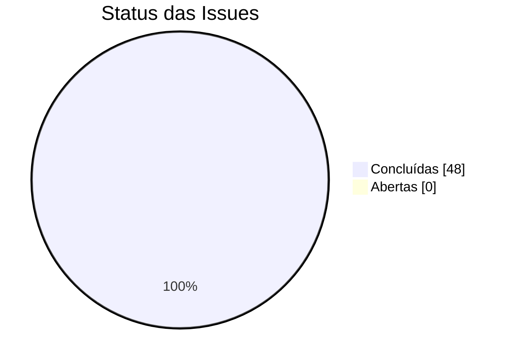
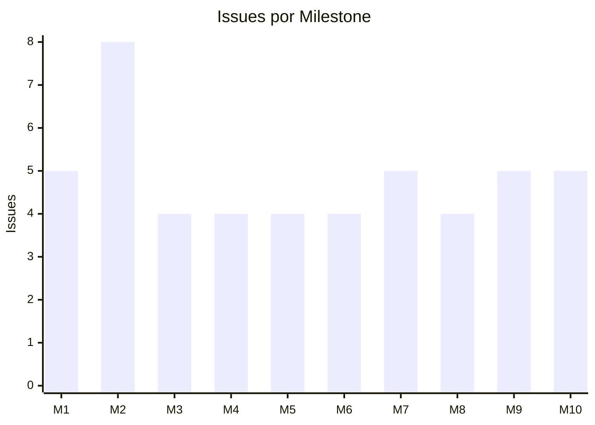
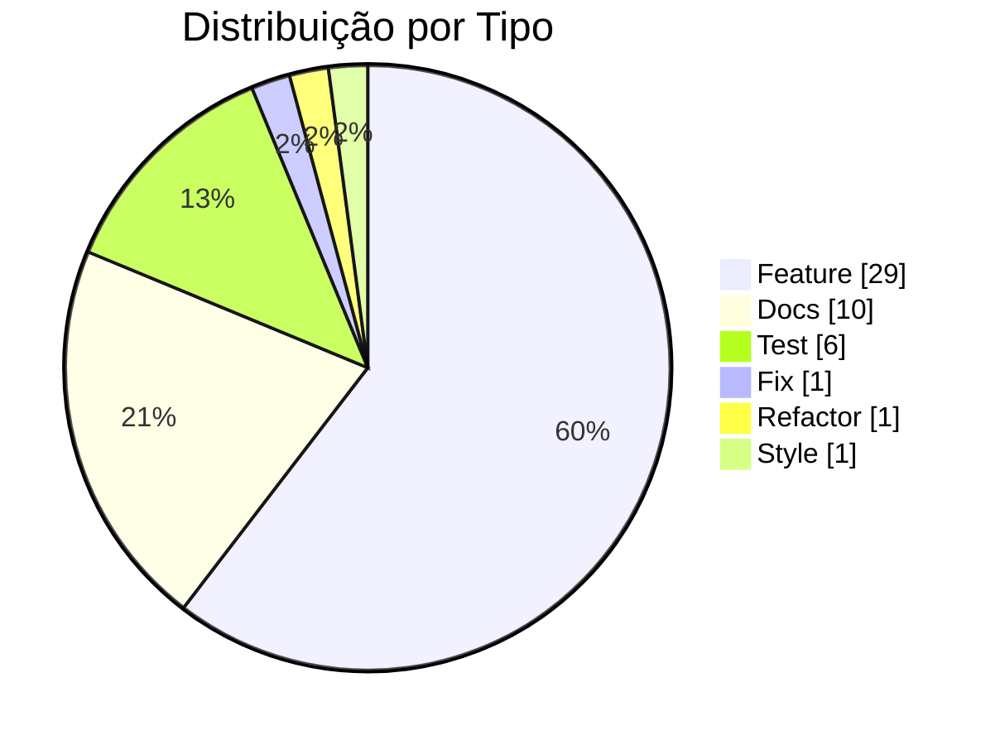
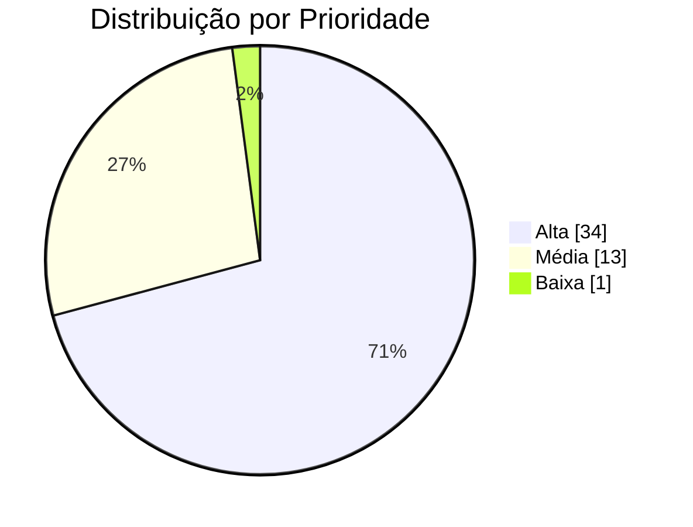
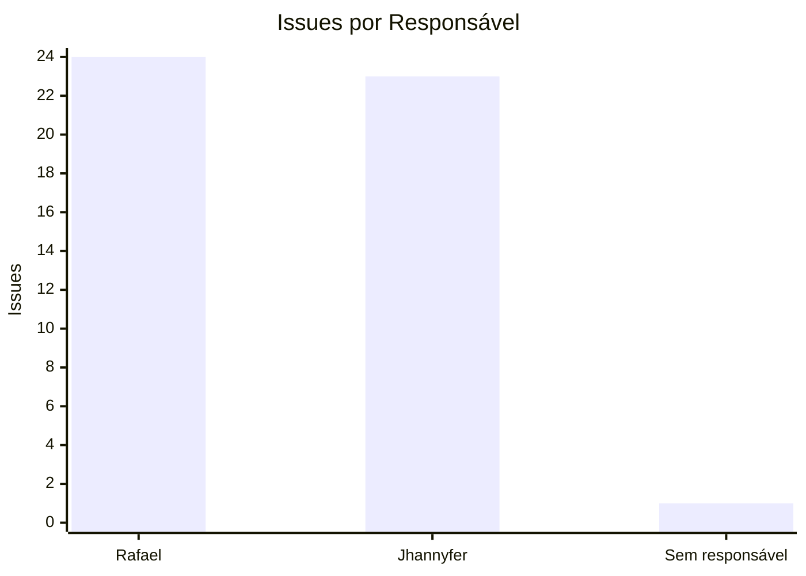
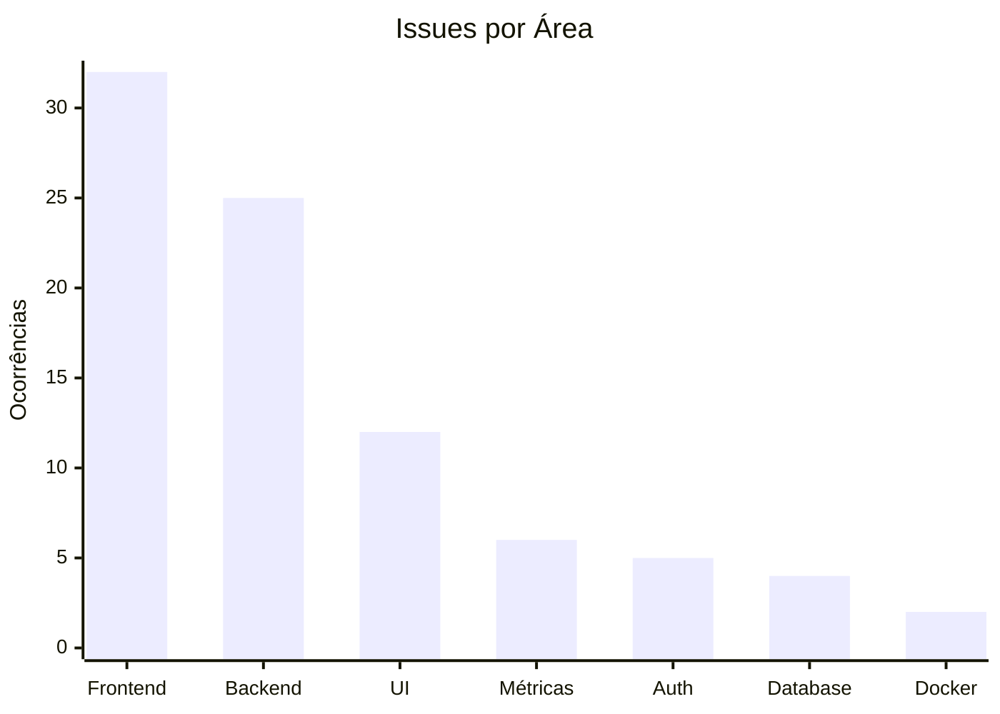
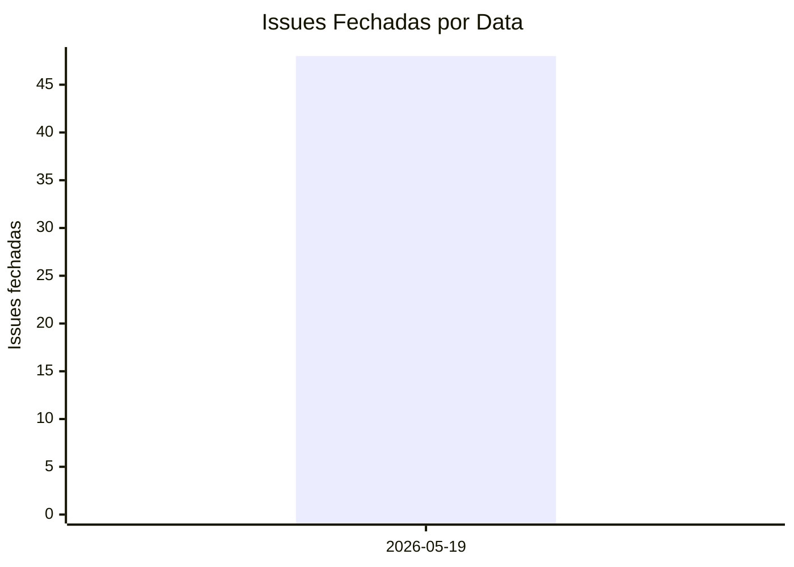

# Gráficos com Dados do GitHub - PadrãoCerto

**Data da coleta**: 2026-05-19  
**Fonte**: GitHub Issues e Project `PadrãoCerto - Desenvolvimento`  
**Repositório**: `RafaelTeixeira1/padraocerto`

---

## 1. Status das Issues

Todas as issues planejadas para o projeto foram fechadas.



| Status | Quantidade | Percentual |
|---|---:|---:|
| Concluídas | 48 | 100% |
| Abertas | 0 | 0% |

---

## 2. Issues por Milestone



| Milestone | Quantidade |
|---|---:|
| M1 - Estrutura Inicial e Infraestrutura | 5 |
| M2 - UI Base e Navegação | 8 |
| M3 - Banco de Dados e Models | 4 |
| M4 - Autenticação e Usuários | 4 |
| M5 - Gestão de Obras | 4 |
| M6 - Gestão de Checklists | 4 |
| M7 - Execução de Inspeções | 5 |
| M8 - Dashboard e Relatórios | 4 |
| M9 - Testes, Ajustes e Usabilidade | 5 |
| M10 - Métricas e Documentação Final | 5 |

---

## 3. Issues por Tipo



| Tipo | Quantidade |
|---|---:|
| Feature | 29 |
| Docs | 10 |
| Test | 6 |
| Fix | 1 |
| Refactor | 1 |
| Style | 1 |

---

## 4. Issues por Prioridade



| Prioridade | Quantidade | Percentual |
|---|---:|---:|
| Alta | 34 | 70,8% |
| Média | 13 | 27,1% |
| Baixa | 1 | 2,1% |

---

## 5. Issues por Responsável



| Responsável | Quantidade |
|---|---:|
| RafaelTeixeira1 | 24 |
| jhannyfer | 23 |
| Sem responsável | 1 |

---

## 6. Issues por Área

Uma issue pode ter mais de uma área, por isso a soma desta tabela é maior que 48.



| Área | Ocorrências |
|---|---:|
| Frontend | 32 |
| Backend | 25 |
| UI | 12 |
| Métricas | 6 |
| Auth | 5 |
| Database | 4 |
| Docker | 2 |

---

## 7. Fechamento por Data



| Data | Issues fechadas |
|---|---:|
| 2026-05-19 | 48 |

---

## 8. Comandos de Coleta

```bash
gh issue list --repo RafaelTeixeira1/padraocerto --state all --limit 100 \
  --json number,title,state,labels,milestone,assignees,createdAt,closedAt
```

```bash
gh project item-list 2 --owner RafaelTeixeira1 --limit 100 --format json
```

---

## 9. Conclusão

O quadro do GitHub Project ficou com:

```text
48 Concluído
```

Isso indica que o backlog planejado para o MVP foi totalmente concluído e movido para a coluna final do Kanban.
