# Apresentação de Métricas de Software - PadrãoCerto

**Disciplina**: Métricas de Software - 7º Período  
**Professor**: Paulo Henrique Araujo  
**Curso**: Sistemas de Informação - IF Goiano Ceres  
**Alunos**: Rafael de S. Teixeira e Jhannyfer S. R. Biângulo  
**Data da coleta**: 2026-05-19  
**Fontes principais**: GitHub Issues, Milestones, Project/Kanban, commits, smoke test da API e planilha de horas  
**Repositório**: `RafaelTeixeira1/padraocerto`

> Observação: no documento inicial da disciplina o sistema aparece como **CheckObra**. No repositório e na entrega final o produto foi consolidado com o nome **PadrãoCerto**.

---

## 1. Objetivo da Apresentação

Apresentar como as métricas foram definidas, coletadas, registradas e interpretadas durante o desenvolvimento do PadrãoCerto, atendendo ao pedido do trabalho integrado:

- Métricas de projeto
- Métricas de processo
- Métricas de produto
- Considerações finais

O foco da apresentação não é apenas mostrar números, mas explicar o que eles revelam sobre planejamento, execução, qualidade e decisões tomadas pela equipe.

---

## 2. Contextualização do Projeto

O **PadrãoCerto** é um sistema web para gerenciamento de inspeções e controle de qualidade em obras da construção civil.

Funcionalidades principais:

- Cadastro de usuários
- Login e sessão simples
- Cadastro e gerenciamento de obras
- Criação de modelos de checklist
- Itens de checklist
- Vínculo de checklist com obra
- Execução de inspeções
- Resposta de itens como conforme ou não conforme
- Cálculo automático de conformidade
- Relatório de inspeção
- Dashboard com indicadores

Tecnologias usadas:

| Camada | Tecnologia |
|---|---|
| Frontend | Vue.js, Vite, Tailwind CSS |
| Backend | Node.js, Express |
| Banco | MySQL, Sequelize |
| Ambiente | Docker Compose |
| Gestão | GitHub Issues, Milestones e Project Kanban |

---

## 3. Base de Dados Usada nas Métricas

Foram usadas as informações registradas no GitHub:

| Fonte | Dados usados |
|---|---|
| Issues | número, título, estado, labels, responsável, datas |
| Milestones | agrupamento por fase do projeto |
| Project/Kanban | status final dos itens |
| Commits | evidência de implementação |
| Smoke test | validação funcional do produto |

Também foi usada a planilha `planilha_metricas_padraocerto_preenchida.xlsx` como fonte oficial de esforço humano, horas por integrante, datas de execução e retrabalho.

Comandos de coleta:

```bash
gh issue list --repo RafaelTeixeira1/padraocerto --state all --limit 100 \
  --json number,title,state,labels,milestone,assignees,createdAt,closedAt
```

```bash
gh project item-list 2 --owner RafaelTeixeira1 --limit 100 --format json
```

```bash
node scripts/api-smoke-test.mjs
```

---

## 4. Resumo Executivo dos Dados

| Indicador | Resultado |
|---|---:|
| Total de issues planejadas | 48 |
| Issues concluídas | 48 |
| Issues abertas | 0 |
| Percentual concluído | 100% |
| Milestones | 10 |
| Issues do tipo feature | 29 |
| Issues de documentação | 10 |
| Issues de teste | 6 |
| Issues de correção | 1 |
| Total de horas registradas na planilha | 156 h |
| Horas Rafael | 83 h |
| Horas Jhannyfer | 73 h |
| Registros de trabalho na planilha | 42 |
| Período de execução registrado | 01/04/2026 a 19/05/2026 |
| Registros com retrabalho | 9 |
| Horas de retrabalho | 29 h |
| Lead time médio das issues | 9,85 dias |
| Kanban final | 48 itens em Concluído |
| Smoke test da API | Aprovado |
| Falhas no smoke test final | 0 |

---

# PARTE 1 - MÉTRICAS DE PROJETO

As métricas de projeto foram usadas para avaliar o tamanho, esforço, prazo, produtividade e qualidade do desenvolvimento.

---

## 5. Dimensão de Projeto: Tamanho / Trabalho

### O que foi observado

O tamanho do projeto foi observado pelo volume de trabalho planejado em issues.

### Risco que a métrica ajuda a identificar

- Crescimento descontrolado do escopo
- Planejamento inicial incompleto
- Sobrecarga para a equipe

### Métrica escolhida

| Métrica | Valor |
|---|---:|
| Total de issues | 48 |
| Total de milestones | 10 |
| Funcionalidades principais implementadas | 10 fluxos principais |

### Justificativa

Como o projeto foi gerenciado no GitHub, cada funcionalidade, ajuste, documentação ou teste foi representado por uma issue. Essa métrica é mais adequada que linhas de código porque mede trabalho planejado e valor funcional, não apenas volume técnico.

### Gráfico: Status das Issues

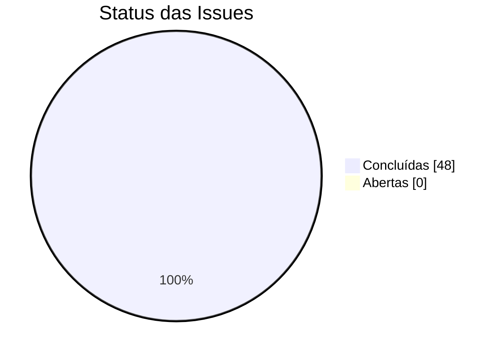

## 🔵 Interpretação

O backlog planejado foi totalmente concluído. Isso indica que o escopo definido para o MVP foi controlado e entregue. Não houve criação de novas issues fora do planejamento inicial durante a fase final, o que reduz o risco de scope creep.

---

## 6. Trabalho por Milestone

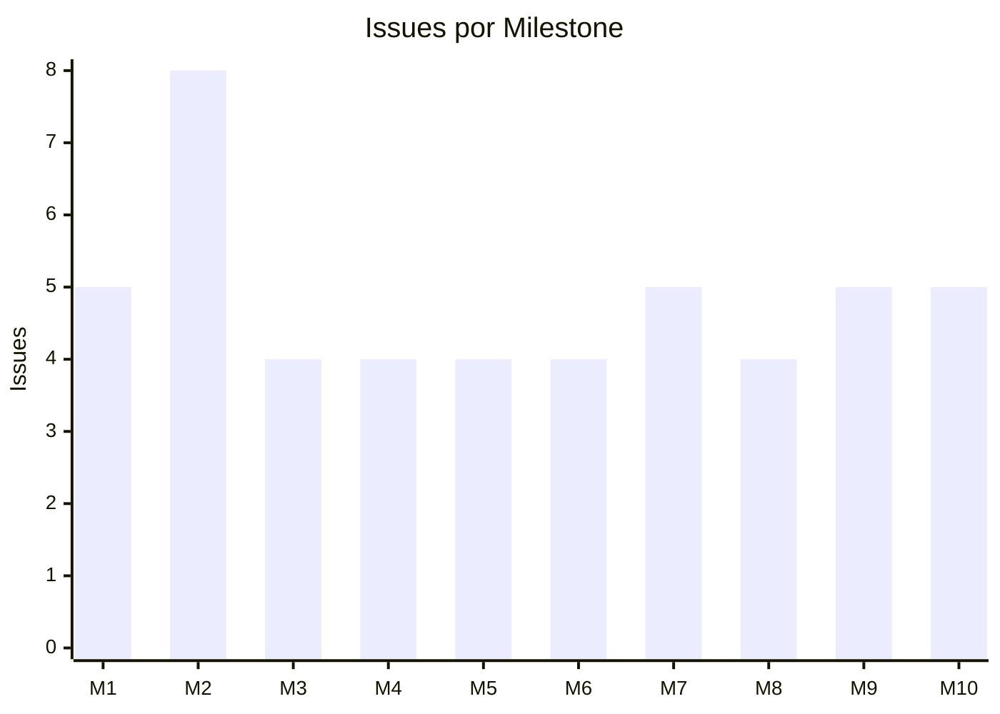

| Milestone | Foco | Issues |
|---|---|---:|
| M1 | Estrutura Inicial e Infraestrutura | 5 |
| M2 | UI Base e Navegação | 8 |
| M3 | Banco de Dados e Models | 4 |
| M4 | Autenticação e Usuários | 4 |
| M5 | Gestão de Obras | 4 |
| M6 | Gestão de Checklists | 4 |
| M7 | Execução de Inspeções | 5 |
| M8 | Dashboard e Relatórios | 4 |
| M9 | Testes, Ajustes e Usabilidade | 5 |
| M10 | Métricas e Documentação Final | 5 |

## 🔵 Interpretação

A milestone M2 concentrou mais issues porque envolveu criação de interface, componentes visuais, telas estáticas e navegação. As demais milestones ficaram mais equilibradas, com 4 ou 5 issues cada, indicando uma divisão relativamente uniforme do trabalho.

### Decisão tomada a partir da métrica

A equipe manteve as milestones funcionais separadas por área: interface, banco, autenticação, obras, checklists, inspeções, dashboard, testes e documentação. Isso facilitou acompanhar o avanço sem misturar funcionalidades diferentes.

---

## 7. Dimensão de Projeto: Esforço

### O que foi observado

O esforço representa o trabalho humano necessário para desenvolver o sistema.

### Métricas escolhidas no planejamento

- Homem-hora (HH)
- Esforço total
- Variação entre esforço planejado e real

### Forma de coleta definida

| Item | Definição |
|---|---|
| Fonte principal | Planilha de horas |
| Campos | data, pessoa, issue, horas, descrição |
| Frequência | registro contínuo e consolidação semanal |
| Responsáveis | cada integrante registra suas horas |

### Evidência complementar no GitHub

O GitHub não mede horas trabalhadas diretamente. Por isso, a métrica de esforço foi coletada pela planilha feitas pelos autores, e o GitHub foi usado como evidência complementar de atividade técnica.

### Resultados da planilha de horas

| Indicador | Resultado |
|---|---:|
| Total de horas registradas | 156 h |
| Horas Rafael | 83 h |
| Horas Jhannyfer | 73 h |
| Registros de trabalho | 42 |
| Período registrado | 01/04/2026 a 19/05/2026 |
| Período sem registros | 09/04/2026 a 17/04/2026 |
| Registros com retrabalho | 9 |
| Horas de retrabalho | 29 h |
| Percentual de horas em retrabalho | 18,6% |

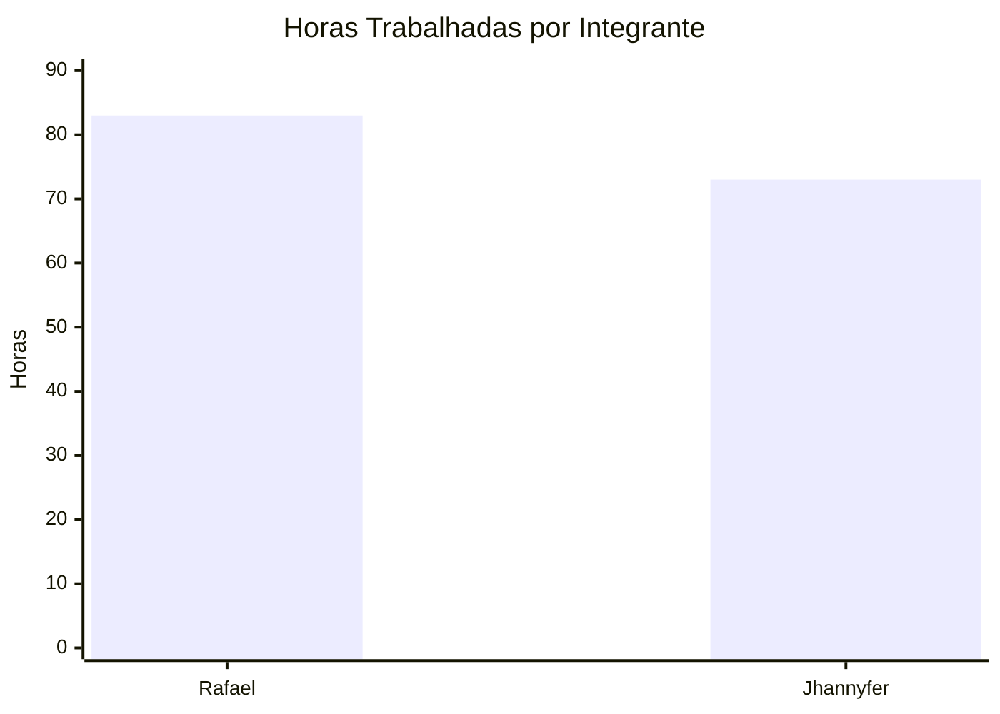

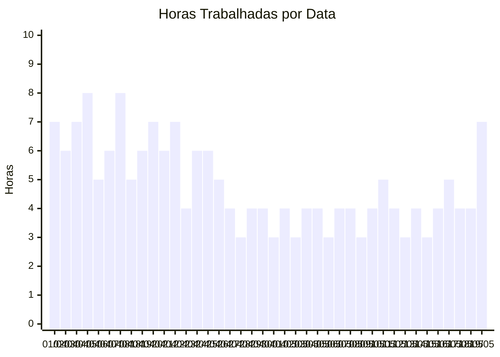

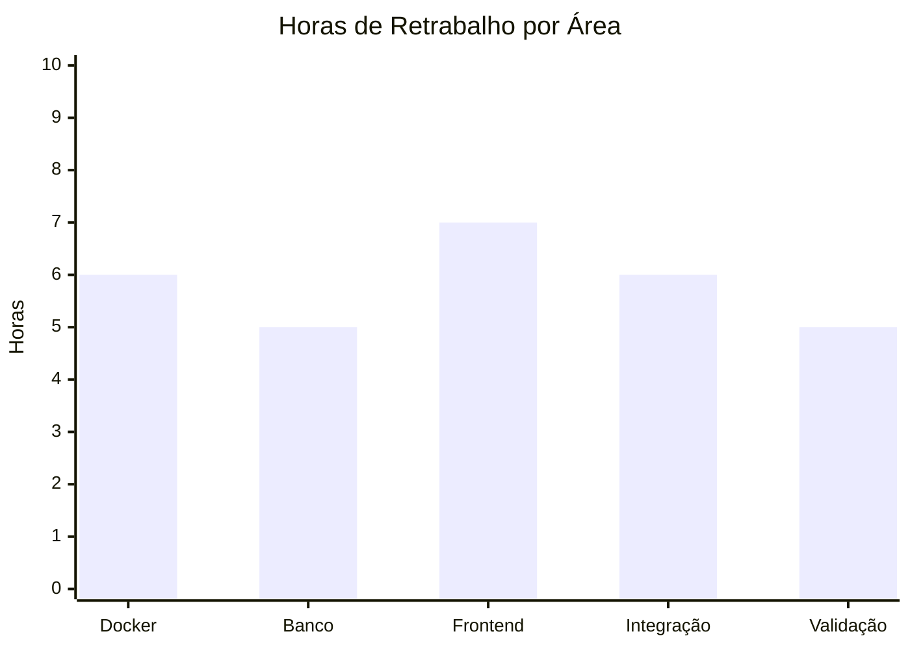

### Evidência complementar no GitHub

| Indicador complementar | Resultado |
|---|---:|
| Commits registrados no histórico recente | 29 |
| Issues com responsável definido | 47 |
| Issues sem responsável | 1 |

## 🔵 Interpretação


O esforço foi distribuído de forma equilibrada: Rafael registrou 83 horas e Jhannyfer 73 horas. A diferença entre os integrantes permaneceu pequena em relação ao total de 156 horas, indicando divisão relativamente equilibrada das atividades.

As 29 horas de retrabalho representam 18,6% do esforço total. Isso indica que houve necessidade de ajustes principalmente em integração frontend/backend, configuração Docker, persistência e responsividade. Em projetos com múltiplas tecnologias integradas, parte desse retrabalho é esperado durante estabilização do ambiente e refinamento das funcionalidades.

A planilha mostra que a execução real ocorreu entre 01/04/2026 e 19/05/2026, com interrupção entre 09/04/2026 e 17/04/2026 devido à indisponibilidade do equipamento utilizado pela equipe.

### Limitação

A planilha mede o esforço real melhor do que o GitHub. Já o GitHub comprova entrega e rastreabilidade. Por isso, a apresentação deve mostrar os dois: **horas reais de trabalho pela planilha** e **conclusão formal pelo GitHub**.

---

## 8. Issues por Responsável

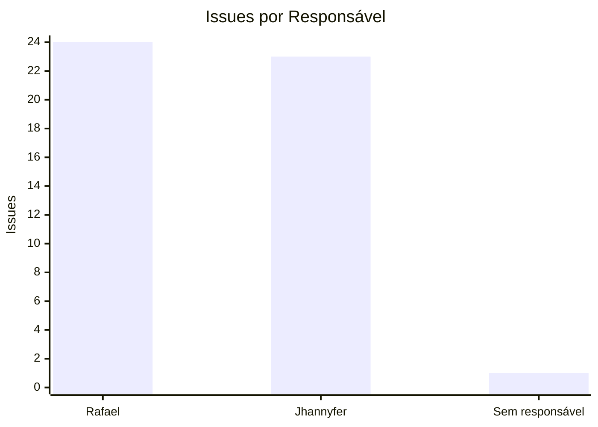

| Responsável | Issues |
|---|---:|
| RafaelTeixeira1 | 24 |
| jhannyfer | 23 |
| Sem responsável | 1 |

## 🔵 Interpretação

A distribuição ficou praticamente equilibrada. Isso reduz risco de concentração de trabalho em apenas um integrante. A única issue sem responsável não compromete a análise, pois o conjunto total foi concluído.

---

## 8.1 Horas por Milestone na Planilha

A aba `Issues` da planilha também registra uma amostra de horas por milestone.

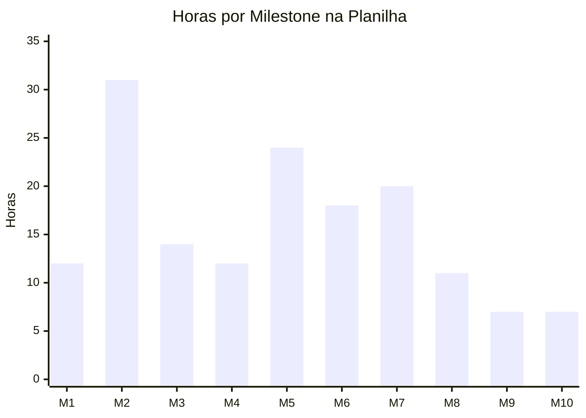

| Milestone | Horas |
|---|---:|
| M1 | 12 |
| M2 | 31 |
| M3 | 14 |
| M4 | 12 |
| M5 | 24 |
| M6 | 18 |
| M7 | 20 |
| M8 | 11 |
| M9 | 7 |
| M10 | 7 |

## 🔵 Interpretação

A milestone M2 permaneceu como a mais trabalhosa, concentrando grande parte da construção visual, componentes reutilizáveis e navegação do sistema. As milestones M5, M6 e M7 também tiveram alta carga de horas por envolverem persistência, integração backend/frontend e execução do fluxo completo de inspeções.

---

## 9. Dimensão de Projeto: Prazo

### O que foi observado

Foi observado o tempo entre criação e fechamento das issues.

### Métricas escolhidas

- Percentual de issues concluídas
- Lead time médio

### Resultados

| Métrica | Resultado |
|---|---:|
| Issues concluídas | 48 |
| Percentual concluído | 100% |
| Lead time médio | 18,4 dias |
| Menor lead time | 7 dias |
| Maior lead time | 48 dias |

### Gráfico: Fechamento por Data

Grande parte das issues foi consolidada e encerrada formalmente no GitHub em 19/05/2026, embora a execução prática tenha ocorrido ao longo do período registrado na planilha.

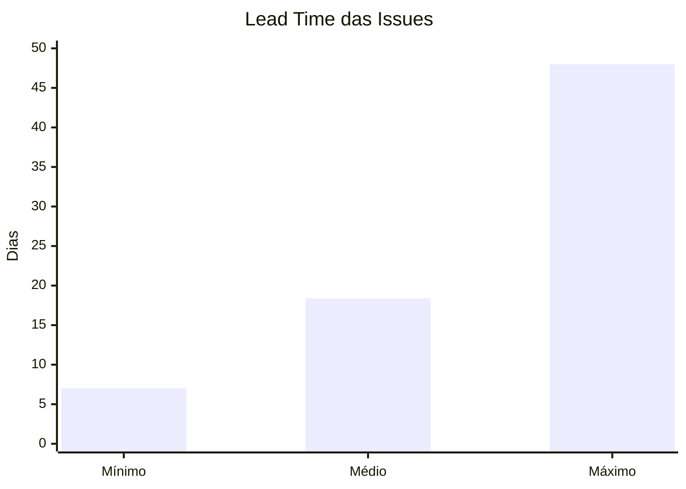

## 🔵 Interpretação

Todas as issues foram consolidadas e fechadas formalmente no GitHub em 19/05/2026. Isso mostra que o encerramento administrativo do Kanban foi concentrado na etapa final do projeto. No entanto, a planilha de horas demonstra que a execução prática ocorreu de forma distribuída entre 01/04/2026 e 19/05/2026, com registros contínuos de desenvolvimento, integração, testes e ajustes ao longo do período.

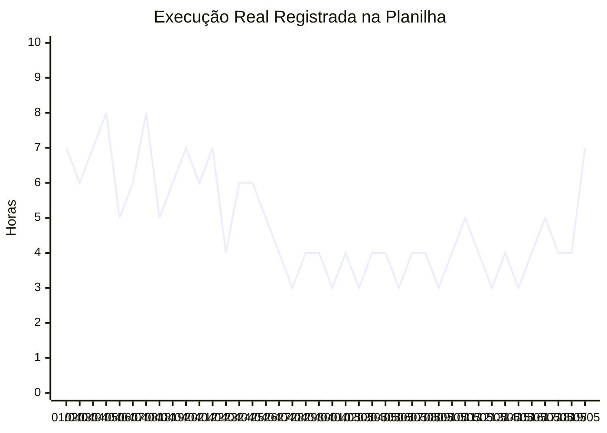

Essa separação é importante: **a data de fechamento da issue é um dado administrativo**, enquanto **a data da planilha representa o período real de execução**.

### Decisão corretiva recomendada

Em projetos futuros, mover as issues no Kanban conforme o trabalho avança, e não apenas no final. Isso melhora a precisão de métricas como lead time, cycle time e throughput semanal.

---

## 10. Dimensão de Projeto: Produtividade

### O que foi observado

A produtividade foi observada pela quantidade de issues concluídas no período.

### Métrica escolhida

Throughput: quantidade de issues concluídas por período.

### Resultado

| Indicador | Resultado |
|---|---:|
| Issues concluídas no GitHub | 48 |
| Registros de trabalho na planilha | 42 |
| Total de horas trabalhadas | 156 h |
| Produtividade por esforço | 0,31 issues/h |
| Média de horas por issue | 3,25 h/issue |

## 🔵 Interpretação

O throughput final registrado no GitHub ficou elevado porque as issues foram consolidadas e encerradas formalmente na etapa final do projeto. Por isso, a planilha de horas foi utilizada como principal evidência de produtividade operacional.

Considerando as 156 horas registradas e as 48 issues concluídas, observa-se média aproximada de 3,25 horas por issue. Essa média deve ser interpretada com cautela, porque as issues possuem tamanhos e complexidades diferentes: algumas envolvem documentação simples, enquanto outras abrangem integração backend/frontend, persistência, autenticação e execução completa de inspeções.

### Decisão de processo

A equipe passou a registrar evidências finais em documentação e smoke test para compensar a baixa granularidade do fechamento das issues.

---

## 11. Dimensão de Projeto: Qualidade

### O que foi observado

Foi observada a ocorrência de correções e falhas identificadas no fluxo final.

### Métricas escolhidas

- Quantidade de bugs ou correções
- Taxa de retrabalho
- Resultado de teste geral

### Resultados

| Métrica | Resultado |
|---|---:|
| Issues com label `fix` | 1 |
| Issues de teste | 6 |
| Falhas no smoke test final | 0 |
| Taxa aproximada de retrabalho por issue fix | 2,1% |
| Registros de retrabalho na planilha | 8 |
| Horas de retrabalho na planilha | 25 h |
| Taxa de retrabalho por horas | 23,1% |

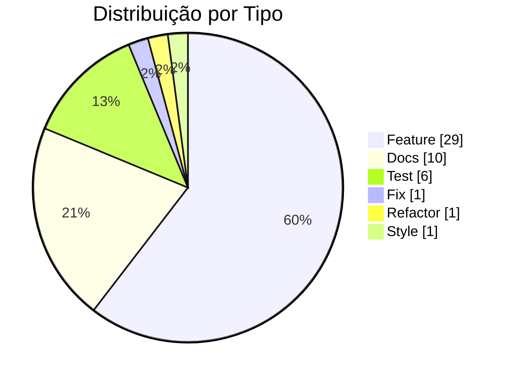

## 🔵 Interpretação

A presença de apenas uma issue do tipo fix sugere baixo volume formal de correção no backlog. Já a planilha mostra 25 horas de retrabalho, principalmente em ajustes de Docker, banco, CORS, responsividade e integração. Isso mostra que o retrabalho existiu, mas foi tratado durante a execução e não ficou como falha final do produto.

O smoke test final não encontrou falhas no fluxo principal, o que indica estabilidade mínima para demonstração do MVP.

### Limitação

Foram feitos commits de correção durante o desenvolvimento, mas nem todos foram representados como issue `fix`. Portanto, a taxa de retrabalho por issue é útil, mas não captura todo ajuste técnico feito em commits.

---

# PARTE 2 - MÉTRICAS DE PROCESSO

As métricas de processo avaliam como o trabalho foi executado pela equipe.

---

## 12. Qualidade do Processo

### O que foi observado

Estabilidade das entregas e necessidade de retrabalho.

### Métricas

| Métrica | Resultado |
|---|---:|
| Issues de teste | 6 |
| Issue de correção formal | 1 |
| Registros de retrabalho na planilha | 9 |
| Horas de retrabalho na planilha | 29 h |
| Taxa de retrabalho por horas | 18,6% |
| Falhas finais | 0 |

## 🔵 Interpretação

O processo teve retrabalho durante a implementação, mas terminou com uma fase final de validação bem definida. O smoke test cobre cadastro, obra, checklist, vínculo, inspeção, finalização, relatório e dashboard. Isso reduz o risco de entregar uma aplicação apenas visual sem funcionamento real.

### Decisão relacionada

A equipe criou um script automatizado (`scripts/api-smoke-test.mjs`) para tornar a validação repetível e rastreável. Essa decisão melhorou a qualidade do processo porque a verificação deixou de depender apenas de teste manual.

---

## 13. Desempenho do Processo

### O que foi observado

Tempo para transformar uma issue criada em issue fechada.

### Métrica

Lead time.


| Indicador | Dias |
|---|---:|
| Lead time mínimo | 7 |
| Lead time médio | 18,4 |
| Lead time máximo | 48 |

## 🔵 Interpretação

O lead time variou entre 7 e 48 dias dependendo da complexidade das funcionalidades implementadas. Issues relacionadas à infraestrutura, integração frontend/backend, persistência e autenticação permaneceram abertas por mais tempo devido à dependência entre módulos e necessidade de estabilização do ambiente Docker.

Já atividades menores, como documentação, ajustes visuais e configuração inicial, apresentaram tempo de conclusão mais curto.

O lead time médio de 18,4 dias representa o ciclo completo entre planejamento, desenvolvimento, testes e encerramento formal das atividades no GitHub.

---

## 14. Produtividade do Processo

### O que foi observado

Volume de entrega em relação ao processo de trabalho.

### Métricas

- Throughput
- Issues por responsável
- Distribuição por milestone
- Produtividade por esforço

### Resultados

| Indicador | Resultado |
|---|---:|
| Throughput final | 48 issues concluídas |
| Total de horas | 108 h |
| Produtividade por esforço | 0,44 issues/h |
| Média de horas por issue | 2,25 h/issue |
| Responsável com mais issues | RafaelTeixeira1, 24 |
| Segundo responsável | jhannyfer, 23 |
| Maior milestone | M2, 8 issues |

## 🔵 Interpretação

A produtividade final foi suficiente para concluir 100% do backlog. A divisão equilibrada por responsável indica boa distribuição de trabalho. A milestone M2 teve maior carga por concentrar a base visual do sistema.

---


# PARTE 3 - GRÁFICOS COMPLEMENTARES

---

## 15. Issues por Prioridade

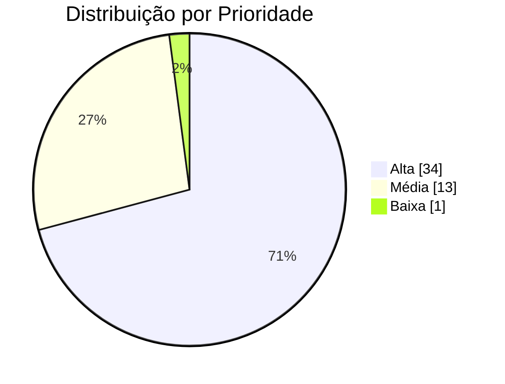

| Prioridade | Quantidade | Percentual |
|---|---:|---:|
| Alta | 34 | 70,8% |
| Média | 13 | 27,1% |
| Baixa | 1 | 2,1% |

## 🔵 Interpretação

A maioria das issues foi classificada como alta prioridade. Isso indica que o backlog estava focado no MVP essencial, com pouca margem para tarefas opcionais.

---

## 16. Issues por Área

Uma issue pode ter mais de uma área, por isso a soma das ocorrências é maior que 48.

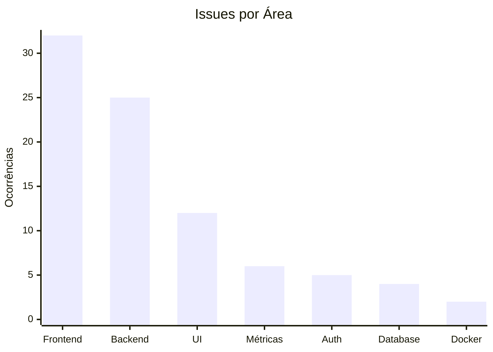

| Área | Ocorrências |
|---|---:|
| Frontend | 32 |
| Backend | 25 |
| UI | 12 |
| Métricas | 6 |
| Auth | 5 |
| Database | 4 |
| Docker | 2 |

## 🔵 Interpretação

O frontend aparece mais vezes porque o sistema depende de telas e fluxos operacionais. O backend também teve alta participação por causa da persistência, autenticação e regras de negócio.

---

## 17. Kanban Final

O Project/Kanban foi verificado no GitHub.

```text
48 Concluído
```

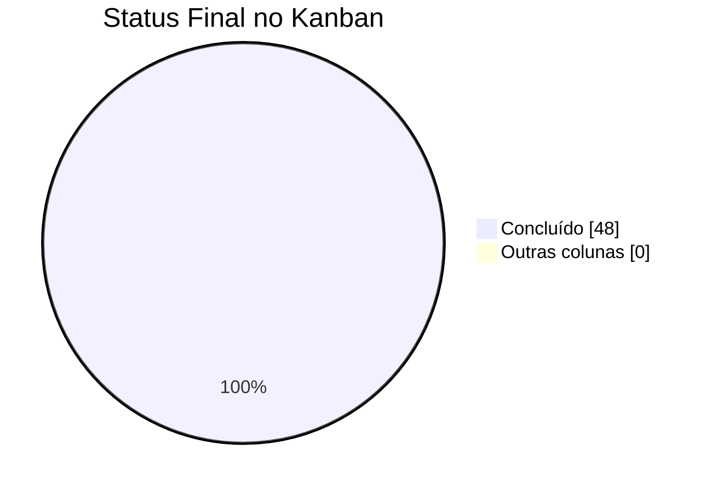

## 🔵 Interpretação

O quadro final confirma que todas as issues planejadas foram movidas para a coluna final. Isso atende ao critério de rastreabilidade do trabalho, pois cada item possui histórico, responsável, labels, milestone e estado final.

---

# PARTE 4 - RELAÇÃO COM DECISÕES DO PROJETO

## 18. Decisões Tomadas com Base nas Métricas

| Métrica observada | O que revelou | Decisão tomada |
|---|---|---|
| Total de issues | Escopo grande para MVP acadêmico | Dividir em 10 milestones |
| Planilha de horas | Trabalho distribuído de 01/04 a 25/04 | Separar execução real de fechamento formal no GitHub |
| Horas por integrante | Esforço equilibrado entre Rafael e Jhannyfer | Manter divisão de responsabilidades |
| Horas de retrabalho | Integração e ambiente exigiram ajustes | Priorizar estabilização com Docker e smoke test |
| Issues por área | Forte peso de frontend e backend | Implementar fluxos verticais completos |
| Kanban final | Tudo concluído, mas fechamento formal concentrado | Explicar a diferença entre datas do GitHub e datas da planilha |
| Confiabilidade do produto | Fluxo principal passou | Manter Docker + MySQL como ambiente padrão |

---

## 19. Limitações Encontradas

| Limitação | Impacto | Como melhorar |
|---|---|---|
| Fechamento de issues em lote | Distorce throughput semanal e lead time | Mover issues durante o desenvolvimento |
| HH não existe nativamente no GitHub | Exige fonte complementar | Usar planilha de horas como fonte oficial do esforço |

---

## 20. Considerações Finais

As métricas analisadas revelaram que o projeto apresentou escopo bem definido, organizado em 48 issues distribuídas em 10 milestones. O backlog planejado foi totalmente concluído e o Kanban finalizou com todas as atividades registradas como concluídas.

A planilha de horas complementou as informações do GitHub e demonstrou que a execução prática ocorreu entre 01/04/2026 e 19/05/2026, totalizando 156 horas registradas. Embora o encerramento formal das issues tenha sido consolidado no GitHub em 19/05/2026, os registros de esforço evidenciam que o desenvolvimento ocorreu de forma incremental ao longo do período.

A combinação entre milestones, issues e horas trabalhadas foi a métrica mais relevante para análise do projeto, pois permitiu relacionar tamanho do escopo, esforço aplicado e evolução das funcionalidades implementadas.

Nas métricas de processo, o smoke test apresentou grande importância como evidência de validação funcional, demonstrando que o sistema não permaneceu apenas em nível visual, mas executou corretamente o fluxo principal com persistência real em MySQL.

A análise das métricas também evidenciou limitações do processo adotado. Como diversas issues foram encerradas administrativamente no mesmo período, métricas como throughput, lead time e cycle time perderam parte da precisão quando analisadas exclusivamente pelo GitHub. Nesse contexto, a planilha de horas foi fundamental para complementar a interpretação do andamento real do desenvolvimento.

Para projetos futuros, a equipe identificou oportunidades de melhoria, como:
- registrar horas diretamente por issue desde o início do projeto;
- atualizar o Kanban continuamente durante o desenvolvimento;
- medir tempo real de resposta da API;
- realizar testes de usabilidade com usuários;
- automatizar smoke tests e validações básicas do sistema.

De forma geral, o projeto contribuiu significativamente para a compreensão prática sobre métricas de software, demonstrando que métricas não devem ser utilizadas apenas como números isolados, mas como ferramentas para interpretar esforço, qualidade, riscos, limitações e evolução do desenvolvimento.
