# Itens 5 e 6 - Trabalho Integrado de Metricas de Software - Versao para PDF

**Projeto:** PadraoCerto / CheckObra  
**Equipe:** Rafael de S. Teixeira e Jhannyfer S. R. Biangulo  
**Periodo analisado:** 01/04/2026 a 19/05/2026  
**Fontes:** GitHub Issues, milestones, commits, planilha de horas e smoke test da API.

> Observacao: no documento inicial o sistema aparece como CheckObra. No repositorio e na entrega final o produto foi consolidado com o nome PadraoCerto.

---

## Resumo executivo

| Indicador | Resultado |
|---|---:|
| Issues planejadas | 48 |
| Issues concluidas | 48 |
| Percentual concluido | 100% |
| Milestones | 10 |
| Horas registradas | 156 h |
| Horas Rafael | 83 h |
| Horas Jhannyfer | 73 h |
| Horas de retrabalho | 29 h |
| Percentual de retrabalho | 18,6% |
| Lead time medio | 18,4 dias |
| Commits registrados | 28 |
| Falhas no smoke test final | 0 |

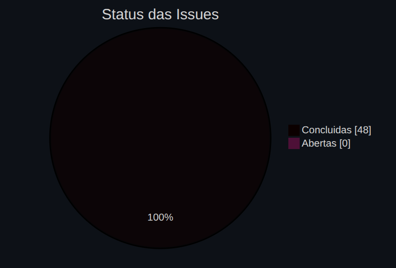

---

## Item 5 - Registro dos dados periodicamente

Os dados foram registrados de forma rastreavel a partir das issues do GitHub, milestones, commits do repositorio e planilha de horas da equipe. O GitHub foi utilizado para acompanhar escopo, prazo, produtividade e distribuicao das atividades. A planilha de horas foi usada para medir esforco humano e retrabalho, pois o GitHub nao registra homem-hora diretamente.

### Evidencia da planilha de horas

A imagem abaixo mostra a planilha utilizada pela equipe para registrar data, responsavel, issue, descricao da atividade, status, horas trabalhadas, indicacao de retrabalho e observacoes. Essa planilha foi usada como fonte principal para calcular esforco, distribuicao de horas e percentual de retrabalho.

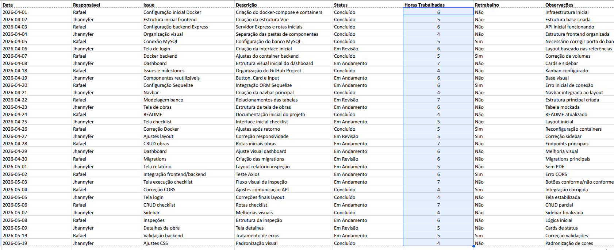

### 5.1 Metricas de projeto registradas

| Dimensao | Metrica registrada | Fonte | Registro consolidado |
|---|---|---|---:|
| Tamanho / Trabalho | Total de issues planejadas | GitHub Issues | 48 issues |
| Tamanho / Trabalho | Total de milestones | GitHub Milestones | 10 milestones |
| Esforco | Horas totais trabalhadas | Planilha de horas | 156 h |
| Esforco | Horas por integrante | Planilha de horas | Rafael: 83 h; Jhannyfer: 73 h |
| Esforco | Registros de trabalho | Planilha de horas | 42 registros |
| Prazo | Issues concluidas | GitHub Issues | 48 issues |
| Prazo | Percentual concluido | GitHub Issues | 100% |
| Prazo | Lead time medio | GitHub Issues | 18,4 dias |
| Produtividade | Throughput final | GitHub Issues | 48 issues concluidas |
| Produtividade | Media de horas por issue | Planilha + Issues | 3,25 h/issue |
| Qualidade | Issues de teste | GitHub Issues | 6 issues |
| Qualidade | Issue formal de correcao | GitHub Issues | 1 issue |
| Qualidade | Horas de retrabalho | Planilha de horas | 29 h |
| Qualidade | Falhas no smoke test final | Smoke test da API | 0 falhas |

### 5.2 Trabalho por milestone

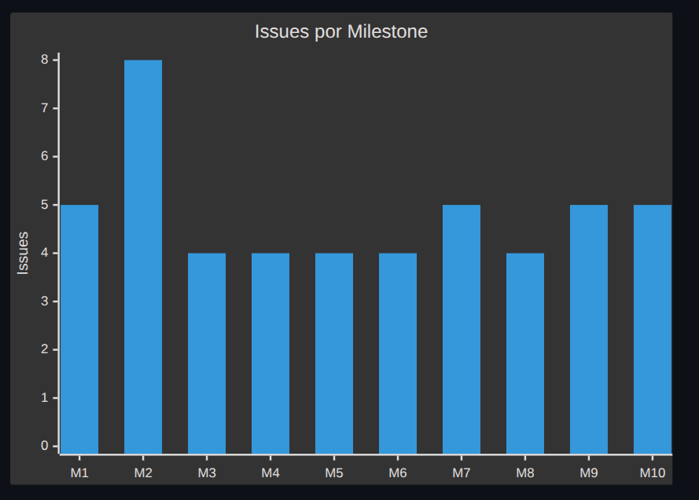

| Milestone | Foco | Issues |
|---|---|---:|
| M1 | Estrutura Inicial e Infraestrutura | 5 |
| M2 | UI Base e Navegacao | 8 |
| M3 | Banco de Dados e Models | 4 |
| M4 | Autenticacao e Usuarios | 4 |
| M5 | Gestao de Obras | 4 |
| M6 | Gestao de Checklists | 4 |
| M7 | Execucao de Inspecoes | 5 |
| M8 | Dashboard e Relatorios | 4 |
| M9 | Testes, Ajustes e Usabilidade | 5 |
| M10 | Metricas e Documentacao Final | 5 |
| **Total** |  | **48** |

### 5.3 Esforco por integrante

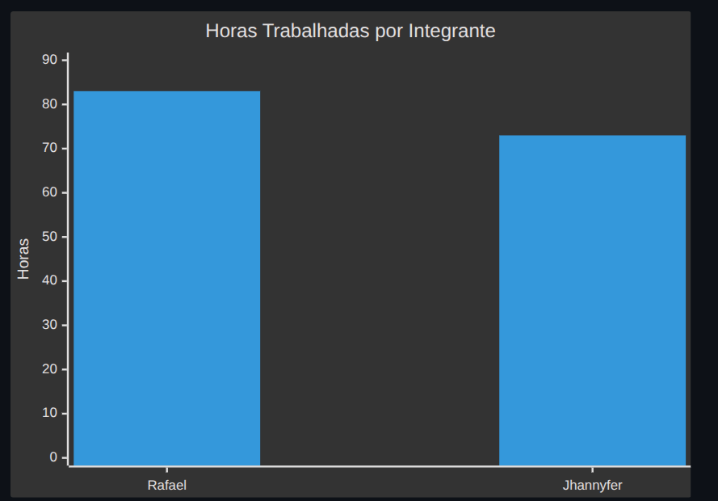

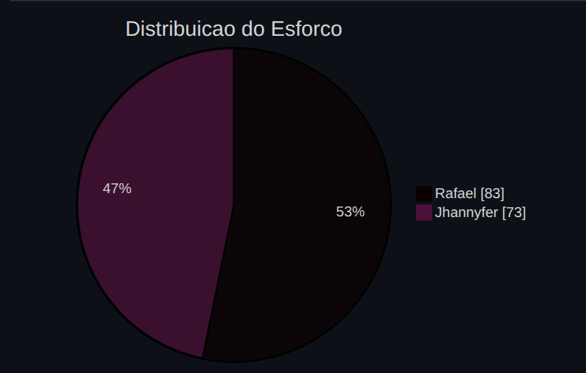

### 5.4 Retrabalho no projeto

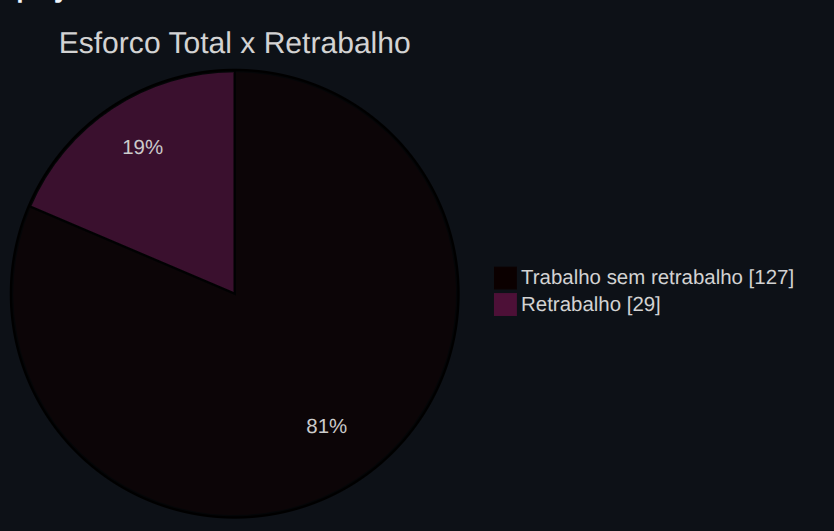

| Indicador | Valor |
|---|---:|
| Horas totais | 156 h |
| Horas sem retrabalho | 127 h |
| Horas de retrabalho | 29 h |
| Percentual de retrabalho | 18,6% |
| Registros com retrabalho | 9 |

### 5.5 Metricas de processo registradas

| Dimensao do processo | Metrica registrada | Fonte | Registro consolidado |
|---|---|---|---:|
| Qualidade do processo | Registros com retrabalho | Planilha de horas | 9 registros |
| Qualidade do processo | Horas de retrabalho | Planilha de horas | 29 h |
| Qualidade do processo | Percentual de retrabalho | Planilha de horas | 18,6% |
| Qualidade do processo | Falhas finais no fluxo principal | Smoke test da API | 0 |
| Desempenho do processo | Lead time minimo | GitHub Issues | 7 dias |
| Desempenho do processo | Lead time medio | GitHub Issues | 18,4 dias |
| Desempenho do processo | Lead time maximo | GitHub Issues | 48 dias |
| Produtividade do processo | Issues concluidas | GitHub Issues | 48 |
| Produtividade do processo | Issues por responsavel | GitHub Issues | Rafael: 24; Jhannyfer: 23; sem responsavel: 1 |
| Produtividade do processo | Commits registrados | Git | 28 commits |

### 5.6 Lead time das issues

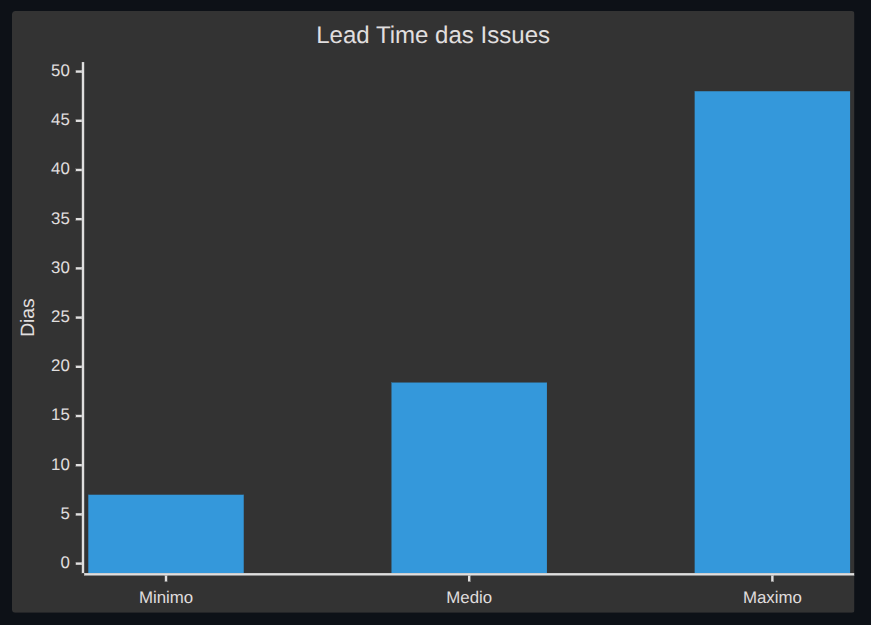

### 5.7 Issues por responsavel

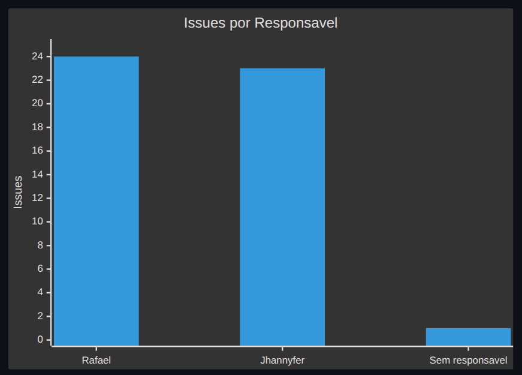

### 5.8 Registro por tipo de atividade

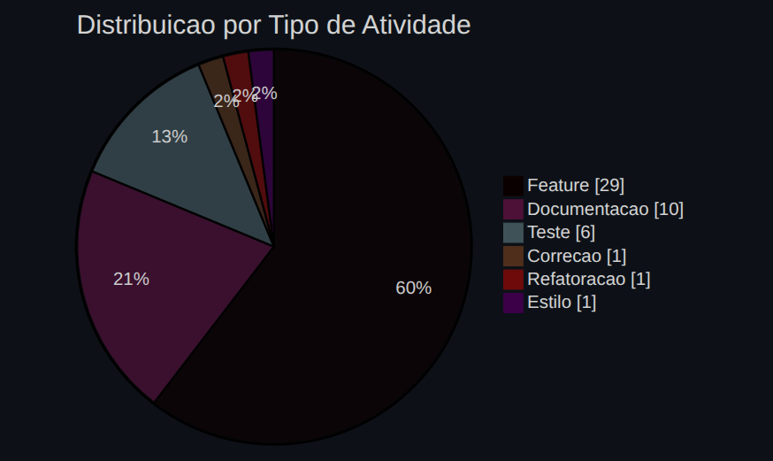

| Tipo / label | Quantidade registrada |
|---|---:|
| Feature | 29 |
| Documentacao | 10 |
| Teste | 6 |
| Correcao | 1 |
| Refatoracao | 1 |
| Estilo / responsividade | 1 |

### 5.9 Registro por prioridade

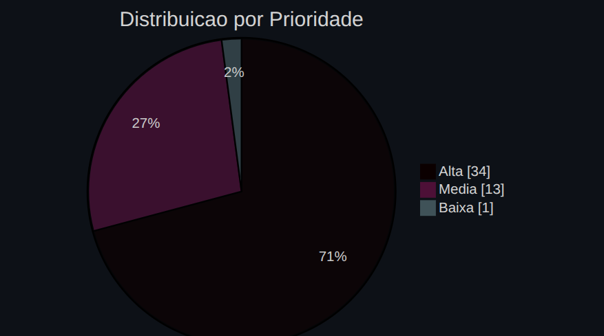

| Prioridade | Quantidade | Percentual aproximado |
|---|---:|---:|
| Alta | 34 | 70,8% |
| Media | 13 | 27,1% |
| Baixa | 1 | 2,1% |

### 5.10 Issues por area tecnica

Uma issue pode ter mais de uma area, por isso a soma das ocorrencias e maior que 48.

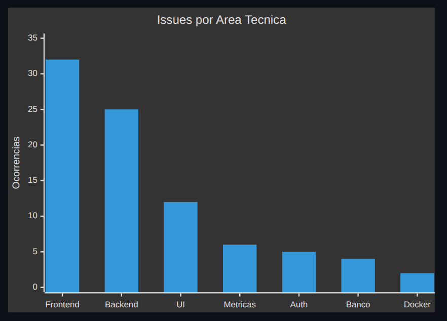

| Area | Ocorrencias |
|---|---:|
| Frontend | 32 |
| Backend | 25 |
| UI | 12 |
| Metricas | 6 |
| Auth | 5 |
| Banco de dados | 4 |
| Docker | 2 |

---

## Item 6 - Analise e interpretacao das variacoes observadas

### 6.1 Tamanho / Trabalho

O escopo final ficou organizado em 48 issues distribuidas em 10 milestones. A maior variacao ocorreu na milestone M2, com 8 issues, enquanto a maioria das outras milestones ficou entre 4 e 5 issues.

Essa variacao ocorreu porque a M2 concentrou a criacao da interface base, navegacao, componentes visuais e estrutura inicial das telas. Como o sistema depende fortemente da interacao do usuario com obras, checklists, inspecoes e dashboard, a parte visual exigiu mais tarefas.

A variacao nao indicou descontrole de escopo, pois todas as milestones foram concluidas. Ela indicou apenas que algumas fases tinham mais dependencia funcional do que outras. Nao houve necessidade de reduzir o escopo final, mas a divisao em milestones ajudou a manter o trabalho organizado.

### 6.2 Esforco

O esforco total registrado foi de 156 horas. Rafael registrou 83 horas e Jhannyfer 73 horas, mostrando uma distribuicao relativamente equilibrada entre os integrantes.

A diferenca de 10 horas entre os membros pode ser explicada pela maior concentracao de algumas atividades tecnicas em um integrante, principalmente integracao, ajustes de backend, Docker e validacao final. Mesmo assim, a variacao nao indica sobrecarga grave, pois os dois membros participaram de forma proxima no volume total de trabalho.

O retrabalho representou 29 horas, equivalente a 18,6% do esforco total. Essa variacao indica que parte do tempo precisou ser usada para corrigir integracao frontend/backend, ajustes de ambiente, persistencia no banco e validacoes. A acao corretiva adotada foi reforcar os testes finais e criar um smoke test da API para validar o fluxo principal.

### 6.3 Prazo

Todas as 48 issues foram concluidas, resultando em 100% de conclusao do backlog planejado. O lead time medio foi de 18,4 dias, com variacao entre 7 e 48 dias.

Essa variacao ocorreu porque algumas tarefas eram simples, como documentacao e ajustes visuais, enquanto outras dependiam de varias partes do sistema, como autenticacao, banco de dados, checklists, inspecoes e dashboard. As tarefas mais integradas permaneceram abertas por mais tempo.

A variacao indica uma instabilidade parcial na forma de registro do processo, pois parte das issues foi encerrada formalmente no GitHub em lote na fase final. A execucao real, entretanto, foi acompanhada pela planilha de horas. Como acao corretiva para projetos futuros, a equipe deve atualizar o Kanban e fechar issues assim que cada tarefa for concluida, melhorando a precisao do lead time e do throughput semanal.

### 6.4 Produtividade

A produtividade final foi de 48 issues concluidas em 156 horas, resultando em media aproximada de 3,25 horas por issue.

Essa media deve ser interpretada com cuidado, porque as issues nao tinham o mesmo tamanho. Algumas eram tarefas pequenas de documentacao, enquanto outras envolviam fluxo completo de backend, frontend, banco de dados e testes. Por isso, a produtividade nao deve ser analisada apenas pela quantidade de issues, mas tambem pela complexidade das entregas.

A variacao indica que a equipe conseguiu manter entrega constante o suficiente para concluir o MVP. A necessidade de melhoria esta na padronizacao do tamanho das issues, para que futuras analises de produtividade fiquem mais precisas.

### 6.5 Qualidade

Foram registradas 6 issues de teste, 1 issue formal de correcao e 29 horas de retrabalho. O smoke test final apresentou 0 falhas no fluxo principal.

A variacao entre poucas issues de correcao e varias horas de retrabalho mostra que muitos ajustes foram resolvidos durante o desenvolvimento, sem necessariamente serem registrados como bugs separados no GitHub. Isso revela uma limitacao no registro das falhas, mas tambem mostra que a equipe tratou problemas antes da entrega final.

O resultado final indica melhoria na estabilidade do produto, pois o fluxo principal passou no teste automatizado. A principal acao corretiva foi transformar a validacao manual em um smoke test executavel, aumentando a confiabilidade da entrega.

### 6.6 Qualidade do processo

A qualidade do processo foi observada pela quantidade de retrabalho, issues de teste e resultado da validacao final. O retrabalho de 29 horas indica que houve ajustes relevantes durante o desenvolvimento, principalmente em integracao, ambiente Docker, banco de dados, responsividade e comunicacao entre frontend e backend.

Essa variacao indica que o processo teve pontos de instabilidade durante a construcao, mas terminou com melhoria na fase final, pois o smoke test validou o fluxo principal sem falhas. A decisao mais importante foi incluir verificacao funcional automatizada, reduzindo o risco de demonstrar apenas telas sem funcionamento real.

Para melhorar o processo em projetos futuros, a equipe deve registrar bugs e retrabalhos como issues especificas, usando labels como `bug`, `fix` e `rework`. Isso tornaria a taxa de retrabalho mais rastreavel.

### 6.7 Desempenho do processo

O desempenho do processo foi medido pelo tempo necessario para transformar uma tarefa planejada em uma entrega concluida. O lead time variou de 7 a 48 dias, com media de 18,4 dias.

A variacao ocorreu por tres motivos principais: diferenca de complexidade entre tarefas, dependencia entre frontend/backend/banco e fechamento administrativo de varias issues na fase final. Essa variacao indica que o fluxo de trabalho funcionou para entregar o produto, mas o registro no Kanban poderia ter sido mais frequente.

A acao corretiva recomendada e movimentar as issues semanalmente ou por iteracao, marcando claramente quando uma tarefa entra em desenvolvimento, quando esta em teste e quando foi concluida. Isso permitiria medir tambem o cycle time com maior precisao.

### 6.8 Produtividade do processo

A produtividade do processo foi medida pelo throughput final, distribuicao por responsavel e produtividade por esforco. O projeto finalizou com 48 issues concluidas, 28 commits registrados e distribuicao equilibrada entre Rafael e Jhannyfer.

A variacao mais relevante foi a concentracao de tarefas de alta prioridade: 34 das 48 issues foram classificadas como prioridade alta. Isso mostra que o backlog estava bastante focado no MVP essencial, com pouca margem para tarefas opcionais.

Essa variacao indica melhoria no foco da equipe, pois as atividades mais importantes foram priorizadas. Ao mesmo tempo, tambem mostra risco de sobrecarga, ja que muitas tarefas foram consideradas essenciais. Para trabalhos futuros, a equipe poderia separar melhor o que e obrigatorio, desejavel e opcional, evitando que quase todo o backlog seja classificado como prioridade alta.

---

## Sintese visual das decisoes

| Metrica observada | O que mudou ou variou | Interpretacao | Acao corretiva / decisao |
|---|---|---|---|
| Issues por milestone | M2 teve mais issues que as demais | Maior esforco inicial em UI e navegacao | Manter milestones por area funcional |
| Horas por integrante | Rafael 83 h; Jhannyfer 73 h | Distribuicao equilibrada | Manter divisao de responsabilidades |
| Retrabalho | 29 h de retrabalho | Instabilidade em integracao e ambiente | Reforcar testes e validacao final |
| Lead time | Variou de 7 a 48 dias | Tarefas tinham complexidades diferentes e fechamento em lote | Atualizar Kanban durante o desenvolvimento |
| Produtividade | 48 issues em 156 h | MVP concluido, mas issues tinham tamanhos diferentes | Padronizar granularidade das issues |
| Qualidade final | Smoke test com 0 falhas | Fluxo principal ficou estavel | Manter smoke test como evidencia de entrega |
| Prioridade | 70,8% das issues eram alta prioridade | Backlog focado no essencial | Separar melhor prioridade obrigatoria e opcional |

---

## Conclusao dos itens 5 e 6

Os registros mostram que o projeto foi concluido com 48 issues finalizadas, 10 milestones, 156 horas de esforco registrado e 0 falhas no smoke test final. As principais variacoes observadas ocorreram no esforco, no lead time e no retrabalho, especialmente por causa da integracao entre frontend, backend, banco de dados e ambiente Docker.

A analise indica que o projeto teve escopo controlado e entrega completa do MVP, mas tambem revelou limitacoes no processo de registro das atividades, principalmente pelo fechamento de issues em lote no GitHub. Para projetos futuros, a equipe deve registrar o andamento no Kanban com maior frequencia, criar issues especificas para retrabalho e bugs, e manter testes automatizados desde as primeiras iteracoes.

---

## Consideracoes finais

O uso das metricas ao longo do projeto permitiu compreender o desenvolvimento do PadraoCerto de forma mais concreta, indo alem da percepcao subjetiva de que o sistema estava "andando bem" ou "quase pronto". Os dados mostraram que o projeto teve um escopo definido e concluido, com 48 issues finalizadas, 10 milestones e 100% do backlog planejado entregue. Isso revelou que, do ponto de vista de projeto, a equipe conseguiu manter controle sobre o tamanho do trabalho e concluir o MVP previsto.

Nas metricas de processo, os dados mostraram que a execucao teve uma distribuicao relativamente equilibrada entre os integrantes, com 83 horas registradas por Rafael e 73 horas por Jhannyfer. Ao mesmo tempo, as 29 horas de retrabalho evidenciaram que houve dificuldades reais durante a integracao entre frontend, backend, banco de dados e ambiente Docker. Portanto, as metricas nao serviram apenas para demonstrar produtividade, mas tambem para revelar pontos de instabilidade do processo de desenvolvimento.

Em relacao ao produto, o smoke test final com 0 falhas indicou que o fluxo principal do sistema ficou funcional e estavel para demonstracao. Essa metrica foi importante porque comprovou que o produto nao ficou apenas em telas visuais, mas executava operacoes essenciais como cadastro, vinculacao, inspecao, finalizacao e consulta de indicadores.

As metricas mais relevantes foram o total de issues concluidas, as horas trabalhadas, o percentual de retrabalho, o lead time e o resultado do smoke test. O total de issues e milestones ajudou a acompanhar o escopo. As horas trabalhadas permitiram avaliar o esforco real da equipe. O retrabalho mostrou onde o processo teve problemas. O lead time ajudou a perceber atrasos e diferencas de complexidade entre tarefas. O smoke test serviu como evidencia objetiva da qualidade funcional do produto entregue.

Uma limitacao encontrada foi que o GitHub nao registra automaticamente homem-hora, tornando necessario complementar os dados com uma planilha de horas. Outra limitacao foi o fechamento de varias issues em lote na fase final, o que reduziu a precisao de metricas como lead time, cycle time e throughput semanal. Tambem houve limitacao no registro de bugs, pois parte das correcoes apareceu como retrabalho ou commits de ajuste, mas nao necessariamente como issues especificas de erro.

Mesmo com essas limitacoes, as metricas influenciaram decisoes importantes no desenvolvimento. A divisao em milestones ajudou a organizar o planejamento por areas funcionais. A identificacao de retrabalho levou a equipe a reforcar testes e validacoes finais. A percepcao de que frontend e backend concentravam muitas ocorrencias ajudou a priorizar fluxos completos, evitando entregar partes isoladas do sistema. O smoke test foi adotado como forma de validar o comportamento principal da aplicacao antes da entrega.

A maturidade do grupo no uso de metricas evoluiu durante o projeto. No inicio, as metricas foram tratadas principalmente como forma de registrar atividades e comprovar entregas. Ao longo do desenvolvimento, a equipe passou a perceber que elas tambem ajudam a interpretar riscos, justificar decisoes e identificar melhorias no processo. A principal dificuldade foi manter a coleta sempre atualizada e transformar dados brutos em analises uteis. O principal aprendizado foi que metricas precisam ser interpretadas dentro do contexto do projeto, pois numeros isolados nao explicam sozinhos a qualidade da entrega.

Para projetos semelhantes, recomenda-se registrar horas diretamente por issue desde o inicio, atualizar o Kanban continuamente, criar issues especificas para bugs e retrabalho, definir melhor os criterios de prioridade e manter testes automatizados desde as primeiras iteracoes. Tambem seria importante medir tempo de resposta da API, realizar testes de usabilidade com usuarios e acompanhar metricas de produto de forma mais detalhada. Assim, as metricas deixariam de ser apenas uma exigencia academica e passariam a apoiar melhor o planejamento, a execucao e a melhoria continua do software.
